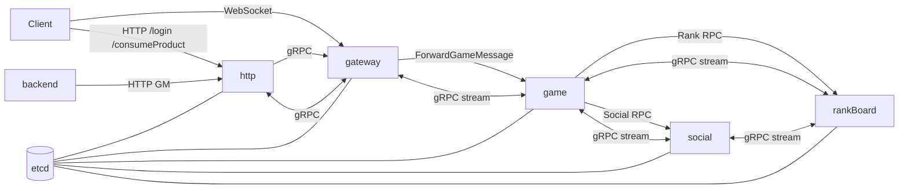

# dhsServer `server` 目录整体架构大纲

> 基于当前代码结构整理（`server/main`、`server/logic`、`server/service`、`server/robot`）。

## 1. 总体架构形态

这是一个**多节点拆分的游戏后端**，以 Go 单仓多进程方式部署。核心节点为：

- `gateway`：客户端 WebSocket 接入层，负责登录、转发、踢人、广播。
- `game`：主游戏逻辑层，承载玩家模型、场景、任务、玩法。
- `social`：社交/联盟服务，独立进程处理联盟数据与并发。
- `rankBoard`：排行榜服务，独立进程维护榜单与持久化。
- `http`：登录/公告/支付回调等 HTTP 接口层。
- `backend`：GM/运营后台接口层。
- `robot`：压测与自动化行为客户端。

节点间通过 **gRPC 双向流 + etcd 服务发现**通信；外部接入为 **WebSocket + HTTP**；数据存储为 **MySQL + Redis**。

## 2. 目录分层（`server`）

| 目录 | 角色 |
|---|---|
| `main/` | 各节点启动入口（`gameMain.go`、`gatewayMain.go`、`httpMain.go` 等） |
| `logic/` | 业务核心层（控制器、模型、平台编排、场景调度、RPC处理、配置加载） |
| `service/` | 基础设施封装（DB、Redis、etcd、gRPC、WebSocket、HTTP、日志） |
| `enum/` | 常量、枚举、Redis Key、SQL模板、消息分类 |
| `tool/` | 通用工具与配置生成工具（含 `xlsx2json`） |
| `robot/` | 机器人框架（登录、发包、回包、运行模式、统计） |
| `module/` | 预留目录（当前为空） |

`logic` 是主体，内部又可视为 5 层：

1. `gameController`：协议入口注册、handler 组织。
2. `model`：领域模型与实体读写。
3. 各玩法服务：`raid`、`mail`、`inventory`、`hero`、`task`、`pass` 等。
4. `platform`：节点启动骨架、路由/分发/会话/场景/服务治理。
5. `rpcController`：跨节点消息收发与回包处理。

## 3. 节点拓扑

## 4. 启动与初始化主链路

所有节点都遵循 `platform.Boot*Service()` 骨架：

1. 读取启动参数/`config/nodeConfig.yaml`。
2. 根据 `nodeType + configName` 从 `platformConfig.yaml`（或 `backendConfig.yaml`）取节点配置。
3. 初始化日志、MySQL、Redis。
4. 初始化路由器、调度器、会话管理器、业务服务。
5. 启动 gRPC 服务并注册到 etcd，监听其他节点变化。
6. 加载 `gameConfig`，注册消息处理函数，进入阻塞 `select{}`。

`game` 节点在此基础上额外初始化：

- `SceneService`（场景与玩家串行执行模型）
- `EventBus`（跨玩法事件）
- `UnlockService`、`ActivityService`、`PassService`
- 主要玩法与模型装配（`gameController.InitGameController` + `model.InitModel`）

## 5. 消息处理模型

### 5.1 路由注册

- 由 `gameController.Register*Message` 统一完成：
  - `router.RegisterMessage(msgType, msgID, protoType)`
  - `dispatcher.RegisterXXXHandler(...)`
- `GameRouter` / `GatewayRouter` 只做三件事：`msgID -> msgType`、反序列化类型定位、分发。

### 5.2 调度器分层

`dispatcherService.Dispatcher` 按节点类型加载不同处理器：

- `gateway`：`GatewayMessageProcessor`
- `game`：`LoginMessageProcessor` + `SceneMessageProcessor`
- `social`：`SocialMessageProcessor`
- `rankBoard`：`RankBoardMessageProcessor`

### 5.3 串行化策略（避免并发写冲突）

- 网关：按 `sessionId % processorNum`。
- 登录：按 `sessionId % processorNum`。
- 玩家玩法：进入场景后按 `Scene -> PlayerTaskChan` 串行。
- 社交：按 `allianceId % processorNum`。
- 排行榜：按 `rand shard`（内部榜结构再处理）。

### 5.4 Scene 执行模型（`logicScene`）

- `SceneManager` 管理 `sceneId -> Scene` 与 `playerId -> sceneId`。
- `Scene` 每 tick 处理：
  - 玩家外部消息队列
  - 内部任务队列
  - 内部回调队列
- `ScenePlayer` 每个玩家独立任务队列 + 心跳存档逻辑。

## 6. 跨节点通信与服务治理

### 6.1 服务发现（`ServerNodeService`）

- 启动时向 etcd 注册 `/node/{nodeType}/{nodeId}`。
- Watch 目标节点前缀，节点上下线触发 `OnNodeConnect/OnNodeDisconnect`。
- 维护进程内节点缓存（`nodeInfoCache`）。

### 6.2 RPC 模型（`rpcController`）

- 使用 gRPC 双向流 + 自动重连客户端（`EasyRpcClient`）。
- 主要通道：
  - `gateway <-> game`（客户端主链路）
  - `game <-> rankBoard`
  - `game <-> social`
  - `social <-> rankBoard`
  - `http -> gateway/game`（充值派发）
- 回包统一落到 `OnReceiveBackward*`，再回注入本地 router/dispatcher。

## 7. 数据存储架构

### 7.1 MySQL 分库角色

- `serverDB`：账号、服务器列表、公告、订单、黑白名单等。
- `gameDB`：玩家主数据。
- `rankDB`：榜单及历史。
- `logDB`：运营日志分月表（异步批量写）。
- `backendDB`：后台管理侧数据。

### 7.2 DB 写入策略（`easyDB + dbPool`）

- `DBPool` 按 `playerId % workerNum` 分发，保障同玩家写入有序。
- `playerBarrier` 计数器用于“等待玩家异步写落盘”（如登出前等待）。

### 7.3 Redis 主要用途

- 玩家基础/战斗缓存（`logicCommon`）。
- 在线人数与会话辅助信息。
- 活动配置与开放活动快照。
- 处理吞吐监控指标（`ThroughputMonitor`）。
- 聊天、邮件刷新通知、登录 token。

## 8. 业务层组织方式

### 8.1 控制器层（`gameController`）

- 通过 `RegisterController` 收敛所有子控制器。
- 通过统一注册函数绑定消息、鉴权、功能解锁校验、错误回包。

### 8.2 模型层（`model`）

- 大量 `*Model` 挂在 `PlayerModel` 聚合根上。
- 登录时集中加载；新玩家走 `CreatePlayer` 初始化全套模型。

### 8.3 配置系统（`gameConfig`）

- 各配置 loader 在 `init` 注册。
- 启动 `LoadAllConfig()`，信号 `SIGHUP` 支持热重载 `ReloadAllConfig()`。
- `xlsx2json` 工具链用于 Excel -> JSON/Go Loader 生成。

## 9. HTTP/后台链路

- `http` 节点提供：
  - `/login`、`/serverInfo`、`/announceInfo`
  - `/consumeProduct`、`/gmConsumeProduct`
- `backend` 节点提供 `/manage/*` 运营接口，并通过 HTTP 调 `http` 节点 GM接口或通过 RPC 广播操作。

## 10. Robot 子系统（`server/robot`）

- 启动入口：`robot.Boot()`。
- 支持 `custom/random` 运行模式、模块化消息组、动态 PB 构建。
- 流程：HTTP 登录拿 `wsAddr+token` -> WS 建连 -> 发登录包 -> 业务循环压测。
- 带请求响应匹配与性能统计汇总。

## 11. 当前架构特征总结

- **优点**
  - 节点职责清晰，网关/游戏/社交/排行解耦。
  - 消息处理链路统一，易扩展新协议。
  - 场景与联盟维度串行化，控制并发冲突。
  - etcd + gRPC stream 支持动态节点发现与长连接通信。

- **需要关注的点**
  - 全局单例较多（跨包全局变量），初始化顺序依赖强。
  - 优雅停服流程较轻（`SIGTERM` 直接 `os.Exit`），资源回收与排空可加强。
  - 个别节点实现中仍有占位/空实现（如部分 session manager、`allInOneMain.go`、`module/`）。
